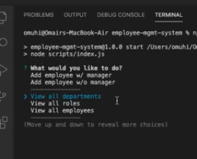

# Employee Content Management System (CMS)

## Description 
This is a CLI-based application that allows users to manage departments, roles and employees in a company. It is implemented using NodeJS and uses a MySQL database in the back-end.

## Table of Contents (Optional)

* [Usage](#usage)
* [Credits](#credits)
* [License](#license)

## Usage 
* To install: `npm install`
* To run: `npm run start`
* Walktrhough video Part-1: https://drive.google.com/file/d/1FOdRjLxPQfpaTeyrMvdPkiQeCvgGRhPp/view
* Walktrhough video Part-2: https://drive.google.com/file/d/1_Xq2srWuVTjJzouYr3sSNVFpEmhv9ADF/view
* Walktrhough video Part-3: https://drive.google.com/file/d/1Nbexav9zkQCN9Gqyqn3mm-oHTHi8Fqa-/view

## Credits
* UoT FSF Bcamp - this template

## License

MIT License

---
© 2019 Trilogy Education Services, a 2U, Inc. brand. All Rights Reserved.
